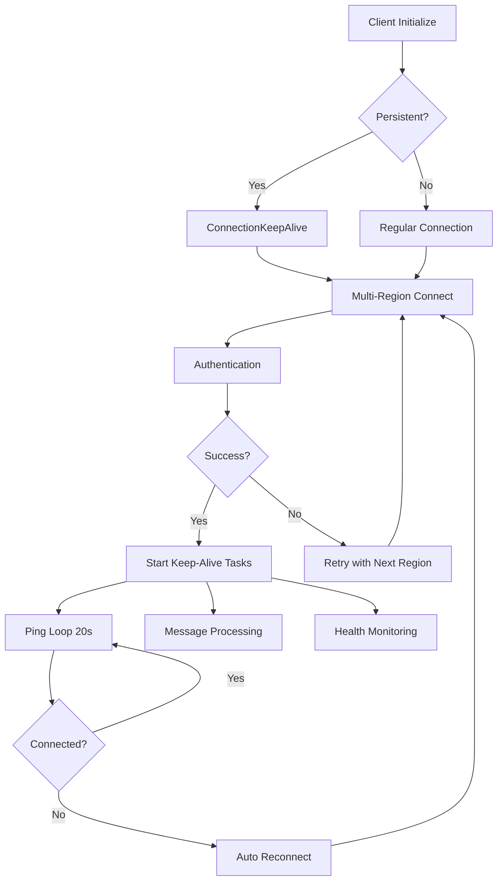

# PocketOption Async API - Enhanced Edition

A comprehensive, modern async Python API for PocketOption trading platform with advanced features including persistent connections, monitoring, and extensive testing frameworks.

## 🚀 Key Features

### ✨ Enhanced Connection Management
- **Complete SSID Format Support**: Works with full authentication strings from browser (format: `42["auth",{"session":"...","isDemo":1,"uid":...,"platform":1}]`)
- **Persistent Connections**: Automatic keep-alive with 20-second ping intervals (like the original API)
- **Auto-Reconnection**: Intelligent reconnection with multiple region fallback
- **Connection Pooling**: Optimized connection management for better performance

### 🔍 Advanced Monitoring & Diagnostics
- **Real-time Monitoring**: Connection health, performance metrics, and error tracking
- **Diagnostics Reports**: Comprehensive health assessments with recommendations
- **Performance Analytics**: Response times, throughput analysis, and bottleneck detection
- **Alert System**: Automatic alerts for connection issues and performance problems

### 🧪 Comprehensive Testing Framework
- **Load Testing**: Concurrent client simulation and stress testing
- **Integration Testing**: End-to-end validation of all components
- **Performance Benchmarks**: Automated performance analysis and optimization
- **Advanced Test Suites**: Edge cases, error scenarios, and long-running stability tests

### ⚡ Performance Optimizations
- **Message Batching**: Efficient message queuing and processing
- **Concurrent Operations**: Parallel API calls for better throughput
- **Caching System**: Intelligent caching with TTL for frequently accessed data
- **Rate Limiting**: Built-in protection against API rate limits

### 🛡️ Robust Error Handling
- **Graceful Degradation**: Continues operation despite individual failures
- **Automatic Recovery**: Self-healing connections and operations
- **Comprehensive Logging**: Detailed error tracking and debugging information
- **Exception Management**: Type-specific error handling and recovery strategies

## 📦 Installation

```bash
# Clone the repository
git clone <repository-url>
cd PocketOptionAPI-3

# Install dependencies
pip install -r requirements.txt

# For development
pip install -r requirements-dev.txt
```

## 🔧 Quick Start

### Basic Usage

```python
import asyncio
from pocketoptionapi_async.client import AsyncPocketOptionClient
from pocketoptionapi_async.models import OrderDirection, TimeFrame

async def main():
    # Complete SSID format (get from browser dev tools)
    ssid = r'42["auth",{"session":"your_session_here","isDemo":1,"uid":12345,"platform":1}]'
    
    # Create client with persistent connection
    client = AsyncPocketOptionClient(
        ssid, 
        is_demo=True,
        persistent_connection=True,  # Enable keep-alive
        auto_reconnect=True         # Enable auto-reconnection
    )
    
    try:
        # Connect
        await client.connect()
        
        # Get balance
        balance = await client.get_balance()
        print(f"Balance: ${balance.balance}")
        
        # Get candles
        candles = await client.get_candles("EURUSD", TimeFrame.M1, 100)
        print(f"Retrieved {len(candles)} candles")
        
        # Place order (demo)
        order = await client.place_order("EURUSD", 10, OrderDirection.CALL, 60)
        print(f"Order placed: {order.order_id}")
        
    finally:
        await client.disconnect()

asyncio.run(main())
```

### Persistent Connection with Keep-Alive

```python
from connection_keep_alive import ConnectionKeepAlive

async def persistent_connection_demo():
    ssid = r'42["auth",{"session":"your_session","isDemo":1,"uid":12345,"platform":1}]'
    
    # Create keep-alive manager
    keep_alive = ConnectionKeepAlive(ssid, is_demo=True)
    
    # Add event handlers
    async def on_connected(data):
        print(f"Connected to: {data['region']}")
    
    async def on_message(data):
        print(f"Message: {data['message'][:50]}...")
    
    keep_alive.add_event_handler('connected', on_connected)
    keep_alive.add_event_handler('message_received', on_message)
    
    try:
        # Start persistent connection (runs indefinitely with auto-reconnect)
        await keep_alive.start_persistent_connection()
        
        # Send messages
        await keep_alive.send_message('42["ps"]')
        
        # Keep running...
        await asyncio.sleep(60)
        
    finally:
        await keep_alive.stop_persistent_connection()

asyncio.run(persistent_connection_demo())
```

## 🔍 Advanced Features

### Connection Monitoring

```python
from connection_monitor import ConnectionMonitor

async def monitoring_demo():
    monitor = ConnectionMonitor(ssid, is_demo=True)
    
    # Add alert handlers
    async def on_alert(alert):
        print(f"ALERT: {alert['message']}")
    
    monitor.add_event_handler('alert', on_alert)
    
    # Start monitoring
    await monitor.start_monitoring()
    
    # Get real-time stats
    stats = monitor.get_real_time_stats()
    print(f"Messages: {stats['total_messages']}, Errors: {stats['total_errors']}")
    
    # Generate diagnostics report
    report = monitor.generate_diagnostics_report()
    print(f"Health Score: {report['health_score']}/100")
    
    await monitor.stop_monitoring()
```

### Load Testing

```python
from load_testing_tool import LoadTester, LoadTestConfig

async def load_test_demo():
    tester = LoadTester(ssid, is_demo=True)
    
    config = LoadTestConfig(
        concurrent_clients=5,
        operations_per_client=20,
        use_persistent_connection=True,
        stress_mode=False
    )
    
    report = await tester.run_load_test(config)
    
    print(f"Throughput: {report['test_summary']['avg_operations_per_second']:.1f} ops/sec")
    print(f"Success Rate: {report['test_summary']['success_rate']:.1%}")
```

### Integration Testing

```python
from integration_tests import IntegrationTester

async def integration_test_demo():
    tester = IntegrationTester(ssid)
    report = await tester.run_full_integration_tests()
    
    print(f"Health Score: {report['integration_summary']['health_score']:.1f}/100")
    print(f"Tests Passed: {report['integration_summary']['passed_tests']}")
```

## 🎯 Getting Your SSID

To use the API with real data, you need to extract your session ID from the browser:

1. **Open PocketOption in your browser**
2. **Open Developer Tools (F12)**
3. **Go to Network tab**
4. **Filter by WebSocket (WS)**
5. **Look for authentication message starting with `42["auth"`**
6. **Copy the complete message including the `42["auth",{...}]` format**

Example SSID format:
```
42["auth",{"session":"abcd1234efgh5678","isDemo":1,"uid":12345,"platform":1}]
```

## 📊 Monitoring and Diagnostics

### Real-time Connection Monitor

```bash
# Start real-time monitoring
python connection_monitor.py "your_ssid_here"
```

Features:
- Real-time connection status
- Performance metrics
- Error tracking
- Health score calculation
- Automatic alerts
- CSV export

### Advanced Testing Suite

```bash
# Run comprehensive tests
python advanced_testing_suite.py "your_ssid_here"
```

Includes:
- Connection stress tests
- Concurrent operations
- Data consistency checks
- Error handling validation
- Performance benchmarks
- Memory usage analysis

### Load Testing

```bash
# Run load tests
python load_testing_tool.py "your_ssid_here"
```

Capabilities:
- Multiple concurrent clients
- Stress testing modes
- Performance analysis
- Bottleneck identification
- Recommendation generation

## 🏗️ Architecture

### Component Overview

```
┌─────────────────────────────────────────────────────────────┐
│                    PocketOption Async API                   │
├─────────────────────────────────────────────────────────────┤
│  AsyncPocketOptionClient (Main API Client)                 │
│  ├── WebSocket Client (Connection Management)              │
│  ├── Keep-Alive Manager (Persistent Connections)          │
│  └── Event System (Callbacks & Handlers)                  │
├─────────────────────────────────────────────────────────────┤
│  Advanced Features                                          │
│  ├── Connection Monitor (Real-time Monitoring)             │
│  ├── Load Tester (Performance Testing)                     │
│  ├── Integration Tester (E2E Validation)                   │
│  └── Advanced Test Suite (Comprehensive Testing)           │
├─────────────────────────────────────────────────────────────┤
│  Infrastructure                                             │
│  ├── Models & Types (Data Structures)                      │
│  ├── Constants & Config (Settings)                         │
│  ├── Exceptions (Error Handling)                           │
│  └── Utils (Helper Functions)                              │
└─────────────────────────────────────────────────────────────┘
```

### Connection Flow



## 🧪 Testing

### Run All Tests

```bash
# Complete integration test suite
python integration_tests.py "your_ssid_here"

# Advanced test scenarios
python advanced_testing_suite.py "your_ssid_here"

# Load and stress testing
python load_testing_tool.py "your_ssid_here"

# Comprehensive demo
python comprehensive_demo.py "your_ssid_here"
```

### Test Categories

1. **Unit Tests**: Individual component testing
2. **Integration Tests**: End-to-end functionality
3. **Load Tests**: Performance under load
4. **Stress Tests**: Extreme condition handling
5. **Monitoring Tests**: Real-time diagnostics
6. **Error Recovery Tests**: Failure scenarios

## 📈 Performance

### Benchmarks

Typical performance metrics (may vary based on network and server conditions):

- **Connection Time**: < 2 seconds
- **Message Latency**: < 100ms
- **Throughput**: 10-50 operations/second
- **Memory Usage**: < 50MB for standard operations
- **CPU Usage**: < 5% during normal operation

### Optimization Features

- **Connection Pooling**: Reuse connections across operations
- **Message Batching**: Group messages for efficiency
- **Caching**: Store frequently accessed data
- **Concurrent Operations**: Parallel processing
- **Rate Limiting**: Prevent API overload

## 🛡️ Error Handling

### Automatic Recovery

- **Connection Loss**: Auto-reconnect with exponential backoff
- **Authentication Errors**: Session refresh and retry
- **Network Issues**: Multiple region fallback
- **API Errors**: Graceful degradation and retry logic

### Error Categories

1. **Connection Errors**: Network and WebSocket issues
2. **Authentication Errors**: Invalid or expired sessions
3. **API Errors**: Invalid parameters or server errors
4. **Timeout Errors**: Operation timeout handling
5. **Rate Limit Errors**: API quota exceeded

## 🔧 Configuration

### Environment Variables

```bash
# Optional configuration
export POCKETOPTION_DEBUG=true
export POCKETOPTION_LOG_LEVEL=DEBUG
export POCKETOPTION_MAX_RETRIES=5
export POCKETOPTION_TIMEOUT=30
```

### Client Configuration

```python
client = AsyncPocketOptionClient(
    ssid="your_ssid",
    is_demo=True,                    # Demo/Live mode
    region="eu",                     # Preferred region
    persistent_connection=True,      # Keep-alive enabled
    auto_reconnect=True,            # Auto-reconnection
    uid=12345,                      # User ID
    platform=1                     # Platform identifier
)
```

## 📚 API Reference

### AsyncPocketOptionClient

Main client class for API operations.

```python
class AsyncPocketOptionClient:
    async def connect(regions: List[str] = None, persistent: bool = None) -> bool
    async def disconnect() -> None
    async def get_balance() -> Balance
    async def get_candles(asset: str, timeframe: TimeFrame, count: int) -> List[Candle]
    async def place_order(asset: str, amount: float, direction: OrderDirection, duration: int) -> OrderResult
    async def send_message(message: str) -> bool
    def get_connection_stats() -> Dict[str, Any]
    def add_event_callback(event: str, callback: Callable) -> None
```

### ConnectionKeepAlive

Advanced connection management with keep-alive.

```python
class ConnectionKeepAlive:
    async def start_persistent_connection() -> bool
    async def stop_persistent_connection() -> None
    async def send_message(message: str) -> bool
    def add_event_handler(event: str, handler: Callable) -> None
    def get_connection_stats() -> Dict[str, Any]
```

### ConnectionMonitor

Real-time monitoring and diagnostics.

```python
class ConnectionMonitor:
    async def start_monitoring(persistent_connection: bool = True) -> bool
    async def stop_monitoring() -> None
    def get_real_time_stats() -> Dict[str, Any]
    def generate_diagnostics_report() -> Dict[str, Any]
    def export_metrics_csv(filename: str = None) -> str
```

## 🤝 Contributing

1. Fork the repository
2. Create a feature branch
3. Make your changes
4. Add tests for new functionality
5. Ensure all tests pass
6. Submit a pull request

### Development Setup

```bash
# Clone and setup
git clone <repository-url>
cd PocketOptionAPI-3

# Install development dependencies
pip install -r requirements-dev.txt

# Run tests
python -m pytest tests/

# Run linting
flake8 pocketoptionapi_async/
mypy pocketoptionapi_async/
```

## 📄 License

This project is licensed under the MIT License - see the LICENSE file for details.

## ⚠️ Disclaimer

This software is for educational and research purposes only. Trading involves substantial risk and may not be suitable for all individuals. Past performance does not guarantee future results. Please trade responsibly and consider your financial situation before using this API for live trading.

## 🆘 Support

- **Issues**: Report bugs or request features via GitHub Issues
- **Documentation**: See examples in the `examples/` directory
- **Discussions**: Join discussions in GitHub Discussions

## 🏆 Changelog

### v2.0.0 - Enhanced Edition

- ✅ Complete SSID format support
- ✅ Persistent connections with keep-alive
- ✅ Advanced monitoring and diagnostics
- ✅ Comprehensive testing frameworks
- ✅ Performance optimizations
- ✅ Enhanced error handling
- ✅ Real-time connection monitoring
- ✅ Load testing capabilities
- ✅ Integration testing suite
- ✅ Modern async architecture

### v1.0.0 - Initial Release

- Basic async API client
- WebSocket connection management
- Core trading operations
- Error handling

---

**Built with ❤️ for the PocketOption community**
